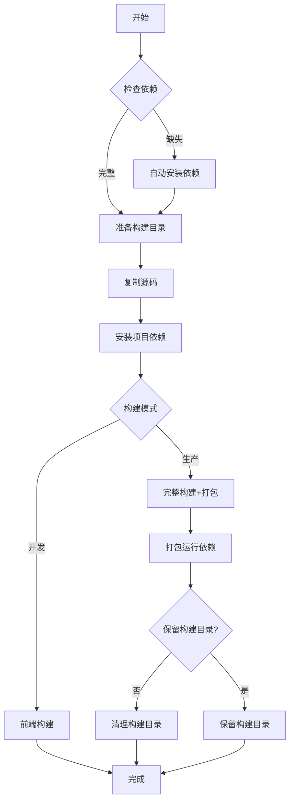

# Moraya 构建指南

本文档介绍如何从源码构建 Moraya 应用程序。

## 目录

- [快速开始（推荐）](#快速开始推荐)
- [系统要求](#系统要求)
- [获取源码](#获取源码)
- [安装依赖](#安装依赖)
- [开发模式](#开发模式)
- [生产构建](#生产构建)
- [测试](#测试)
- [常见问题](#常见问题)

## 快速开始（推荐）

Moraya提供统一构建脚本，自动解决依赖、隔离构建目录、避免影响源码。

### 一键构建

```bash
# Linux/macOS
make build

# 或直接使用脚本
./scripts/build.sh

# Windows
.\scripts\build.ps1
```

### 使用指定构建目录

```bash
# 指定构建目录（避免影响源码目录）
./scripts/build.sh --build-dir ~/build/moraya --keep

# 或使用Makefile
make build-dir DIR=~/build/moraya
```

### 构建选项

```bash
# 查看所有选项
./scripts/build.sh --help

# 常用选项
./scripts/build.sh --clean              # 清理后构建
./scripts/build.sh --keep               # 保留构建目录
./scripts/build.sh --skip-deps          # 跳过依赖安装
./scripts/build.sh --target linux       # 指定目标平台
./scripts/build.sh --package deb        # 指定打包类型
./scripts/build.sh --dev                # 开发构建
./scripts/build.sh --verbose            # 显示详细输出
```

### Makefile简化命令

```bash
# 查看所有命令
make help

# 常用命令
make deps          # 安装依赖
make dev           # 开发构建
make build         # 生产构建
make test          # 运行测试
make clean         # 清理构建产物
make install       # 安装到系统
make uninstall     # 从系统卸载
```

## 构建脚本特性

### 自动依赖解决

构建脚本会自动检测和安装缺失的依赖：

- **Node.js** >= 18.0
- **pnpm** >= 8.0
- **Rust** >= 1.70
- **系统库**（GTK/WebKit/glib等）

```bash
# 自动安装所有依赖
./scripts/build.sh --skip-deps false

# 或手动检查依赖
make deps-check
```

### 构建目录隔离

默认使用临时构建目录（`/tmp/moraya-build`），不影响源码目录：

```bash
# 默认构建目录（自动清理）
/tmp/moraya-build

# 指定构建目录（可选择保留）
~/build/moraya
```

**优点**：
- 源码目录保持干净（无node_modules、build产物）
- 构建产物可单独打包分发
- 支持并行多版本构建

### 打包运行依赖

构建完成后自动打包运行依赖（`node_modules`等）：

```bash
# 产物位置
moraya-dependencies.tar.gz  # Linux/macOS
moraya-dependencies.zip     # Windows

# 或手动打包
make package-deps
```

### 支持多平台打包

```bash
# Linux
./scripts/build.sh --target linux --package all     # 所有包（deb/appimage/rpm）
./scripts/build.sh --target linux --package deb     # 仅DEB
./scripts/build.sh --target linux --package appimage # 仅AppImage

# macOS
./scripts/build.sh --target macos --package all     # 所有包（dmg/app）
./scripts/build.sh --target macos --package dmg     # 仅DMG

# Windows
.\scripts\build.ps1 -Package all                    # 所有包（msi/nsis）
.\scripts\build.ps1 -Package msi                    # 仅MSI
.\scripts\build.ps1 -Package nsis                   # 仅NSIS
```

## 手动构建流程（可选）

如需手动控制构建过程，可参考以下步骤：

## 系统要求

### 通用要求

- **Node.js**: >= 18.0
- **pnpm**: >= 8.0（推荐使用pnpm，不支持npm/yarn）
- **Rust**: >= 1.70（推荐最新stable版本）
- **Git**: 任意版本

### 平台特定要求

#### Linux

- **系统**: Ubuntu 20.04+ / Debian 11+ / Fedora 36+ / Arch Linux
- **依赖库**:
  ```bash
  # Ubuntu/Debian
  sudo apt install -y \
    build-essential \
    libgtk-3-dev \
    libwebkit2gtk-4.1-dev \
    libappindicator3-dev \
    librsvg2-dev \
    libssl-dev \
    libglib2.0-dev
  
  # Fedora
  sudo dnf install -y \
    gtk3-devel \
    webkit2gtk4.1-devel \
    libappindicator-gtk3-devel \
    librsvg2-devel \
    openssl-devel \
    glib2-devel
  
  # Arch Linux
  sudo pacman -S --needed \
    gtk3 \
    webkit2gtk-4.1 \
    libappindicator \
    librsvg \
    openssl \
    glib2
  ```

#### macOS

- **系统**: macOS 11.0 (Big Sur) +
- **Xcode**: Xcode 14+（包含 Command Line Tools）
- **Homebrew**: 推荐安装
  ```bash
  # 安装 Command Line Tools
  xcode-select --install
  
  # 安装依赖（通过Homebrew）
  brew install gtk+3 webkit2gtk librsvg openssl
  ```

#### Windows

- **系统**: Windows 10 1903+ / Windows 11
- **Microsoft Visual Studio**: MSVC v143 - VS 2022 C++ x64/x86 build tools
- **WebView2**: Windows 10/11已预装，或手动安装 [WebView2 Runtime](https://developer.microsoft.com/en-us/microsoft-edge/webview2/)
- **设置**:
  - 安装 [Visual Studio Build Tools](https://visualstudio.microsoft.com/visual-cpp-build-tools/)
  - 选择 "Desktop development with C++"
  - 确保安装 Windows 10 SDK 和 MSVC v143

## 获取源码

```bash
# 克隆仓库
git clone https://github.com/zouwei/moraya.git
cd moraya

# 或使用Gitee镜像（国内用户）
git clone https://gitee.com/solarhu/moraya.git
cd moraya

# 切换到开发分支（可选）
git checkout dev-ai
```

## 安装依赖

### 1. 安装 Node.js 依赖

```bash
# 安装 pnpm（如未安装）
npm install -g pnpm

# 安装项目依赖
pnpm install
```

### 2. 安装 Rust 依赖

```bash
# 安装 Rust（如未安装）
curl --proto '=https' --tlsv1.2 -sSf https://sh.rustup.rs | sh

# 或使用镜像（国内用户）
export RUSTUP_DIST_SERVER="https://rsproxy.cn"
export RUSTUP_UPDATE_ROOT="https://rsproxy.cn/rustup"
curl --proto '=https' --tlsv1.2 -sSf https://rsproxy.cn/rustup-init.sh | sh

# 更新 Rust 到最新版本
rustup update stable

# Cargo 依赖会自动安装，无需手动操作
```

### 3. 验证安装

```bash
# 检查 Node.js 版本
node --version  # 应显示 >= v18.0.0

# 检查 pnpm 版本
pnpm --version  # 应显示 >= 8.0.0

# 检查 Rust 版本
rustc --version  # 应显示 >= 1.70.0
cargo --version

# 检查依赖完整性
pnpm list --depth=0
cargo tree --depth=1
```

## 开发模式

开发模式提供实时热重载，适合开发调试。

### 启动开发服务器

```bash
# 方式1：使用pnpm脚本（推荐）
pnpm tauri dev

# 方式2：分别启动前端和后端
# 前端（端口5173）
pnpm dev

# 后端（新终端窗口）
pnpm tauri dev
```

### 开发服务器特性

- **热重载**: 前端代码修改立即生效
- **调试工具**: 
  - Chrome DevTools（前端）：按 `F12` 或 `Ctrl+Shift+I`
  - Rust日志（后端）：查看终端输出
- **端口**:
  - 前端：http://localhost:5173
  - Tauri窗口：自动打开

### 开发流程建议

1. **修改前端代码** (`src/` 目录)
   - `.svelte` 文件：UI组件
   - `.ts` 文件：业务逻辑
   - 立即生效，无需重启

2. **修改Rust后端代码** (`src-tauri/src/` 目录)
   - 需要重新编译（自动触发）
   - 等待时间：首次编译约2-5分钟，后续增量编译约10-30秒

3. **修改配置文件**
   - `tauri.conf.json`：Tauri配置（需重启）
   - `package.json`：依赖版本（需重新 `pnpm install`）
   - `Cargo.toml`：Rust依赖（需重新编译）

## 生产构建

生产构建生成可分发的安装包。

### 构建命令

```bash
# 构建当前平台安装包
pnpm tauri build

# 或分步构建
pnpm build        # 构建前端（静态文件）
pnpm tauri build  # 构建后端 + 打包
```

### 构建产物

构建完成后，产物位于 `src-tauri/target/release/bundle/`：

#### Linux

- `deb/moraya_0.40.0_amd64.deb` - Debian包（Ubuntu/Debian）
- `appimage/moraya_0.40.0_amd64.AppImage` - AppImage（通用）
- `rpm/moraya_0.40.0_x86_64.rpm` - RPM包（Fedora/RHEL）

#### macOS

- `dmg/moraya_0.40.0_x64.dmg` - DMG安装包（Intel）
- `dmg/moraya_0.40.0_aarch64.dmg` - DMG安装包（Apple Silicon）
- `macos/moraya.app` - macOS应用包

#### Windows

- `msi/moraya_0.40.0_x64.msi` - MSI安装包
- `nsis/moraya_0.40.0_x64-setup.exe` - NSIS安装包（推荐）

### 构建优化

```bash
# 减小包体积（已默认配置）
# Cargo.toml中已设置：
# opt-level = "s"      # 优化体积
# lto = true           # 链接时优化
# codegen-units = 1    # 单编译单元

# 构建时间优化（开发阶段）
# 在 Cargo.toml 中临时添加：
[profile.dev]
opt-level = 0        # 不优化
codegen-units = 256  # 并行编译
```

### 构建大小

- **Linux**: ~15MB（AppImage）
- **macOS**: ~12MB（DMG）
- **Windows**: ~10MB（NSIS）

### 代码签名（可选）

#### macOS

```bash
# 需要Apple Developer账号
# 设置环境变量
export APPLE_SIGNING_IDENTITY="Developer ID Application: Your Name"
export APPLE_CERTIFICATE="path/to/certificate.p12"
export APPLE_CERTIFICATE_PASSWORD="password"

# 构建
pnpm tauri build
```

#### Windows

```bash
# 需要代码签名证书
# 设置环境变量
export WINDOWS_SIGNING_CERTIFICATE="path/to/certificate.pfx"
export WINDOWS_SIGNING_CERTIFICATE_PASSWORD="password"

# 构建
pnpm tauri build
```

## 测试

### TypeScript 测试

```bash
# 运行所有测试
pnpm test

# 监听模式（开发时推荐）
pnpm test:watch

# 运行特定测试文件
pnpm test src/lib/services/lark-sync/sync-service.test.ts

# 查看测试覆盖率
pnpm test --coverage
```

### Rust 测试

```bash
# 运行所有 Rust 测试
cd src-tauri
cargo test

# 运行特定测试
cargo test --lib
cargo test --doc

# 运行测试并显示输出
cargo test -- --nocapture

# 返回项目根目录
cd ..
```

### 类型检查

```bash
# TypeScript 类型检查
pnpm check

# 监听模式
pnpm check:watch
```

### Svelte 检查

```bash
# 已包含在 pnpm check 中
# 单独运行（如需要）
svelte-check --tsconfig ./tsconfig.json
```

## 常见问题

### 1. Rust 编译错误：缺少系统库

**问题**: `error: could not find native static library`

**解决**:
```bash
# Linux：安装缺少的库
sudo apt install -y libssl-dev libglib2.0-dev

# macOS：使用Homebrew
brew install openssl glib

# Windows：检查MSVC Build Tools是否完整安装
```

### 2. WebView2 错误（Windows）

**问题**: `WebView2 not found`

**解决**:
- 下载安装 [WebView2 Runtime](https://developer.microsoft.com/en-us/microsoft-edge/webview2/)
- 或使用Windows 10/11（已预装）

### 3. pnpm install 失败

**问题**: `ERR_PNPM_UNSUPPORTED_ENGINE`

**解决**:
```bash
# 检查Node.js版本
node --version  # 需要 >= 18

# 升级Node.js
# 使用 nvm
nvm install 18
nvm use 18

# 或使用 n
n 18
```

### 4. Rust 版本过低

**问题**: `error: Rust version 1.xx.yy is not supported`

**解决**:
```bash
# 更新 Rust
rustup update stable

# 使用特定版本
rustup default stable
```

### 5. 构建产物过大

**问题**: 安装包体积超过预期

**解决**:
```bash
# 检查 Cargo.toml 配置
# 确保包含：
[profile.release]
opt-level = "s"
lto = true
codegen-units = 1

# 清理并重新构建
cargo clean
pnpm tauri build
```

### 6. macOS 权限问题

**问题**: `permission denied` 或 `codesign failed`

**解决**:
```bash
# 授权开发者工具
sudo spctl --master-disable

# 或在系统偏好设置中：
# 安全性与隐私 → 通用 → 允许从以下位置下载的App：任何来源
```

### 7. Linux webkit2gtk 版本问题

**问题**: `Package 'webkit2gtk-4.0', required by 'webkit2gtk', not found`

**解决**:
```bash
# Ubuntu 22.04+ 使用 webkit2gtk-4.1
sudo apt install -y libwebkit2gtk-4.1-dev

# Ubuntu 20.04 使用 webkit2gtk-4.0
sudo apt install -y libwebkit2gtk-4.0-dev
```

### 8. 测试超时或失败

**问题**: `timeout` 或 `test failed`

**解决**:
```bash
# 增加测试超时时间
# vitest.config.ts 中设置：
test: {
  testTimeout: 10000,
  hookTimeout: 10000,
}

# 清理测试缓存
pnpm test --run --reporter=verbose
```

## 构建环境变量

### 开发环境

```bash
# 设置 Rust 日志级别
export RUST_LOG=debug

# 设置前端环境变量
export VITE_DEV_SERVER_PORT=5173
```

### 生产环境

```bash
# macOS 代码签名
export APPLE_SIGNING_IDENTITY="Developer ID Application: Your Name"

# Windows 代码签名
export WINDOWS_SIGNING_CERTIFICATE="path/to/certificate.pfx"

# 自定义构建目标
export TAURI_BUILD_TARGET=universal  # macOS Universal
```

## 构建脚本参考

### 自动化构建脚本

```bash
#!/bin/bash
# scripts/build-release.sh

# 清理旧构建
cargo clean
rm -rf src-tauri/target/release/bundle

# 安装依赖
pnpm install --frozen-lockfile

# 运行测试
pnpm test
cargo test

# 类型检查
pnpm check

# 构建
pnpm tauri build

# 验证产物
ls -lh src-tauri/target/release/bundle/
```

### CI/CD 构建示例

```yaml
# GitHub Actions 示例
name: Build Release

on: [push, pull_request]

jobs:
  build:
    runs-on: ${{ matrix.os }}
    strategy:
      matrix:
        os: [ubuntu-latest, macos-latest, windows-latest]
    
    steps:
      - uses: actions/checkout@v4
      
      - name: Setup Node.js
        uses: actions/setup-node@v4
        with:
          node-version: 18
      
      - name: Install pnpm
        run: npm install -g pnpm
      
      - name: Setup Rust
        uses: actions-rs/toolchain@v1
        with:
          toolchain: stable
      
      - name: Install dependencies
        run: pnpm install --frozen-lockfile
      
      - name: Run tests
        run: |
          pnpm test
          cargo test
      
      - name: Build
        run: pnpm tauri build
      
      - name: Upload artifacts
        uses: actions/upload-artifact@v4
        with:
          name: release-${{ matrix.os }}
          path: src-tauri/target/release/bundle/
```

## 下一步

构建完成后：

- 阅读 [INSTALLATION.md](./INSTALLATION.md) 了解安装方法
- 阅读 [USAGE.md](./USAGE.md) 了解使用方法
- 阅读 [lark-cli-installation-guide.md](./lark-cli-installation-guide.md) 了解飞书同步配置

## 参考链接

- [Tauri 官方文档](https://tauri.app/v2/guides/)
- [SvelteKit 文档](https://kit.svelte.dev/docs)
- [Vite 文档](https://vitejs.dev/guide/)
- [Rust 安装指南](https://www.rust-lang.org/tools/install)
- [pnpm 文档](https://pnpm.io/installation)

## 构建脚本参数详解

### scripts/build.sh (Linux/macOS)

| 参数 | 说明 | 示例 |
|------|------|------|
| `-d, --build-dir DIR` | 指定构建目录 | `--build-dir ~/build` |
| `-c, --clean` | 清理构建目录 | `--clean` |
| `-k, --keep` | 保留构建目录 | `--keep` |
| `-s, --skip-deps` | 跳过依赖安装 | `--skip-deps` |
| `-t, --target PLATFORM` | 指定构建目标 | `--target linux` |
| `-r, --release` | 生产构建 | `--release` |
| `-D, --dev` | 开发构建 | `--dev` |
| `-p, --package TYPE` | 指定打包类型 | `--package deb` |
| `-v, --verbose` | 详细输出 | `--verbose` |
| `-h, --help` | 显示帮助 | `--help` |
| `--version` | 显示版本 | `--version` |

### scripts/build.ps1 (Windows)

| 参数 | 说明 | 示例 |
|------|------|------|
| `-BuildDir DIR` | 指定构建目录 | `-BuildDir D:\Build` |
| `-Clean` | 清理构建目录 | `-Clean` |
| `-Keep` | 保留构建目录 | `-Keep` |
| `-SkipDeps` | 跳过依赖安装 | `-SkipDeps` |
| `-Target PLATFORM` | 指定构建目标 | `-Target windows` |
| `-Mode MODE` | 构建模式 | `-Mode dev` |
| `-Package TYPE` | 指定打包类型 | `-Package msi` |
| `-Verbose` | 详细输出 | `-Verbose` |
| `-Help` | 显示帮助 | `-Help` |

### Makefile命令

| 命令 | 说明 | 等价脚本调用 |
|------|------|-------------|
| `make help` | 显示帮助 | - |
| `make deps` | 安装依赖 | `build.sh --skip-deps false` |
| `make dev` | 开发构建 | `pnpm tauri dev` |
| `make build` | 生产构建 | `build.sh --release` |
| `make build-dir DIR=...` | 指定目录构建 | `build.sh --build-dir DIR --keep` |
| `make test` | 运行测试 | `pnpm test && cargo test` |
| `make clean` | 清理产物 | `rm -rf build/ ...` |
| `make install` | 安装到系统 | `dpkg -i *.deb` |
| `make uninstall` | 卸载 | `dpkg --remove moraya` |

### 构建流程详解

构建脚本执行流程：



### 构建产物位置

| 构建模式 | 产物位置 | 内容 |
|---------|---------|------|
| **开发构建** | `build-dir/build/` | 前端静态文件 |
| **生产构建** | `build-dir/src-tauri/target/release/bundle/` | 安装包（deb/dmg/msi等） |
| **依赖打包** | `build-dir/moraya-dependencies.tar.gz` | node_modules等运行依赖 |

### 最佳实践

#### 1. 避免污染源码目录

```bash
# 推荐：使用独立构建目录
./scripts/build.sh --build-dir ~/build/moraya --keep

# 不推荐：直接在源码目录构建
# 会产生node_modules、build等大量文件
pnpm install
pnpm tauri build
```

#### 2. 定期清理构建目录

```bash
# 构建前清理
./scripts/build.sh --clean --build-dir ~/build/moraya

# 或手动清理
make clean-build-dir DIR=~/build/moraya
```

#### 3. CI/CD中使用构建脚本

```yaml
# GitHub Actions示例
- name: Build
  run: |
    chmod +x scripts/build.sh
    ./scripts/build.sh --skip-deps --release --clean
```

#### 4. 多版本并行构建

```bash
# 同时构建多个版本（不同构建目录）
./scripts/build.sh --build-dir ~/build/moraya-stable
./scripts/build.sh --build-dir ~/build/moraya-dev --dev
```

#### 5. 分发构建产物

```bash
# 打包构建产物和依赖
tar -czf moraya-v0.40.0-linux.tar.gz \
    build-dir/src-tauri/target/release/bundle \
    build-dir/moraya-dependencies.tar.gz

# 上传到发布页面
# GitHub Releases / Gitee Releases
```